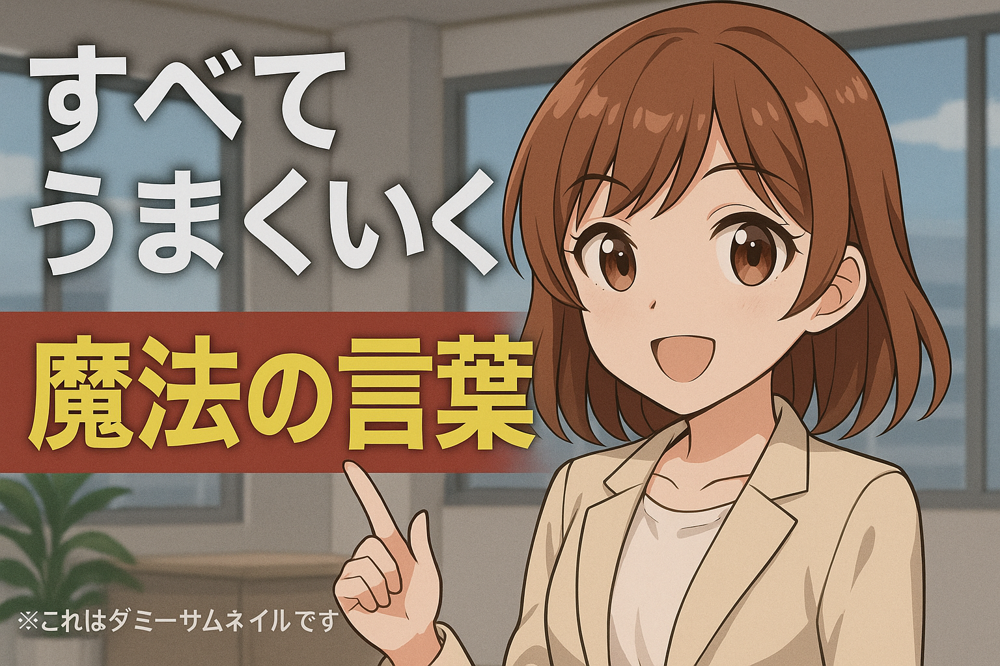

# YouTube Summarizer

YouTube動画の音声を自動で文字起こしし、要約を生成するツールです。サムネイル画像からテキストを抽出し、タイトルとサムネイルを考慮した要約を行います。


  

「魔法の言葉」だけ知りたいときに最適

## ツールの説明

このツールは以下の処理を自動で実行します：

1. **YouTube URL から音声ファイルとサムネイルをダウンロード**
   - yt-dlpを使用してYouTube動画から音声とサムネイル画像を抽出・ダウンロード
   - 音声はmp3形式（192kbps）で保存
   - サムネイルはPNG形式で保存

2. **サムネイル画像からテキストを抽出**
   - Vision対応のLM Studioモデルを使用してサムネイル内のテキストを自動抽出
   - 抽出されたテキストは要約生成時に活用

3. **mp3ファイルを whisper で文字起こし**
   - OpenAI Whisper Large V3 Turboモデルを使用
   - GPU環境に応じて自動でデバイスを選択（MPS/CPU）
   - 読点で改行して見やすくフォーマット

4. **文字起こしの内容を要約しマークダウンファイルにする**
   - LM StudioのAPIを使用して要約を生成
   - 動画情報（タイトル、アップローダー、再生回数など）を含むマークダウン形式で出力
   - タイトルとサムネイルのテキストを考慮した拡張要約機能

5. **結果を整理して保存**
   - 動画タイトルに基づいて安全なディレクトリ名を生成
   - `summarized` ディレクトリに結果を保存

## セットアップ手順

### 1. uv を使った環境構築

```bash
# uvをインストール（まだの場合）
curl -LsSf https://astral.sh/uv/install.sh | sh

# プロジェクトディレクトリに移動
cd /path/to/YouTubeSummarizer

# 仮想環境を作成し、依存関係をインストール
uv venv
uv pip install -r requirements.txt
```

### 2. LM Studioのインストールと設定

1. [LM Studio](https://lmstudio.ai/)をダウンロード・インストール
2. LM Studioを起動し、以下のモデルをダウンロード：
   - **要約用モデル**: `openai/gpt-oss-120b` または同等の性能を持つモデル
   - **Vision用モデル**: `google/gemma-3-27b` またはVision対応のモデル（サムネイルテキスト抽出用）
3. LM Studioでモデルを読み込み、ローカルAPIサーバーを起動（デフォルト: http://localhost:1234）

#### GPU環境に応じたモデル設定

- **GPU環境**: より大きなモデル（例: gpt-oss-120b）を使用可能
- **CPU環境**: 軽量なモデル（例: gpt-oss-7b）を推奨
- **M1/M2 Mac**: MPS対応モデルを選択

### 3. ffmpeg のインストール

#### macOS (Homebrew)
```bash
brew install ffmpeg
```

#### Ubuntu/Debian
```bash
sudo apt update
sudo apt install ffmpeg
```

#### Windows
1. [ffmpeg公式サイト](https://ffmpeg.org/download.html)からダウンロード
2. PATHに追加

## 実行方法

1. `summarize.py` ファイルを開く
2. 20-22行目の `YOUTUBE_URL` を編集してYouTubeのURLを設定：

```python
YOUTUBE_URL = """
https://www.youtube.com/watch?v=YOUR_VIDEO_ID
""".strip()
```

3. LM Studioが起動していることを確認
4. スクリプトを実行：

```bash
# 仮想環境をアクティベート
source .venv/bin/activate  # Linux/Mac
# または
.venv\Scripts\activate     # Windows

# スクリプト実行
python summarize.py
```

## 出力ファイル

実行後、`summarized` ディレクトリ内に動画タイトル名のディレクトリが作成され、以下が生成されます：

- `transcription.txt`: 文字起こし結果
- `summary.md`: 要約結果（マークダウン形式）
- `audio.mp3`: ダウンロードされた音声ファイル
- `thumbnail.png`: ダウンロードされたサムネイル画像
- `thumbnail.txt`: サムネイルから抽出されたテキスト（テキストが検出された場合のみ）

## 設定項目

`summarize.py` 内の設定項目：

- `YOUTUBE_URL`: YouTube動画のURL
- `OUTPUT_DIR`: 出力ディレクトリ（デフォルト: "./output"）
- `STT_DEVICE`: Whisperの実行デバイス（"mps"/"cpu"）
- `STT_MODEL_ID`: WhisperモデルID（デフォルト: "openai/whisper-large-v3-turbo"）
- `LM_STUDIO_API_URL`: LM Studio API URL（デフォルト: "http://localhost:1234/v1/chat/completions"）
- `LM_STUDIO_SUMMARY_MODEL`: 要約用モデル名（デフォルト: "openai/gpt-oss-120b"）
- `LM_STUDIO_VISION_MODEL`: Vision用モデル名（デフォルト: "google/gemma-3-27b"）

## トラブルシューティング

### LM Studioに接続できない場合
- LM Studioが起動しているか確認
- API URL（デフォルト: http://localhost:1234）が正しいか確認
- 要約用モデルとVision用モデルの両方が読み込まれているか確認
- Vision機能を使用する場合は、Vision対応のモデルが選択されているか確認

### ffmpegが見つからない場合
- ffmpegがインストールされているか確認
- PATHに追加されているか確認

### GPU使用時の問題
- CUDA/MPSが正しくインストールされているか確認
- PyTorchがGPU対応版か確認

### サムネイルテキスト抽出が動作しない場合
- Vision対応のモデルが正しく読み込まれているか確認
- サムネイル画像が正常にダウンロードされているか確認
- Vision APIのタイムアウト設定を確認（デフォルト: 120秒）

### ダウンロードに失敗する場合
yt-dlpライブラリのバージョンアップを試してください
```bash
pip install --upgrade yt-dlp
```

## 必要な依存関係

- librosa
- requests
- torch
- transformers
- yt_dlp

詳細は `requirements.txt` を参照してください。

